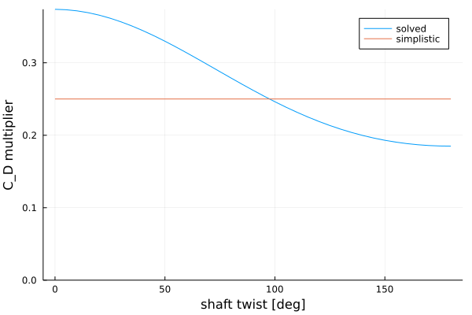
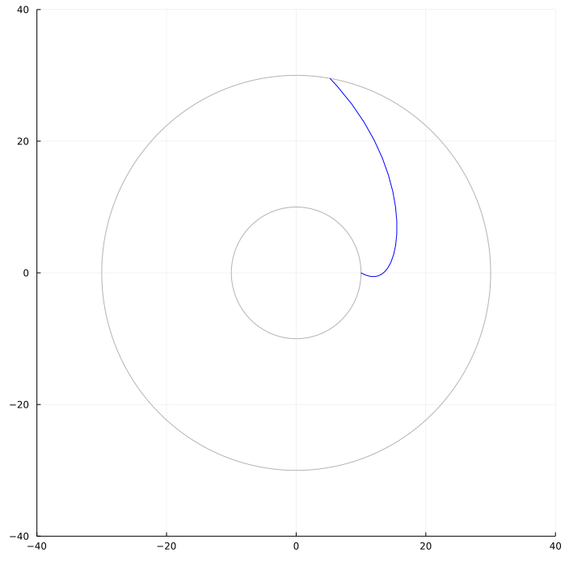

# Tether Drag ODE Solver

## Description

This code improved on varius simplistic tether models for airborne wind energy
[AWE] that maybe assume that the tether is straight and without mass. It does
not go all the way though, implementing a full segmented time simulated model.
Instead, we try to strike a better balance between simplicity and accuracy by
solving the 3D equations governing the tether shape subjected to drag and
centrifugal forces in a quasi-static manner. Note only apparent wind is used
and not actual wind, to make the solution independent on shaft orientation.

After doing that, on emay perhaps opt to go back to the straight line models
after adjusting the effective drag coefficient if necessary.

The code may be used for TRPT [Tensile Rotary Power Transmission] AWE plants
that rely on the shaft to transfer power from the kites to the ground, or also
for more traditional designs such as Yoyo or Flygen [bounding and hovering
flight patterns of a single kite].


An in-depth paragraph about your project and overview of use.

The code runs entirely in Julia.

## Getting Started

### Installing

```julia
pkg> add https://github.com/tallakt/TetherDragODESolver#main
````

### Executing program

To run a simple shaft configuration you could do

```julia
julia> using TetherDragODESolver
julia> ode = let v = 50.0, d = 0.003, r0 = 10.0, r1 = 30.0, omega = v / r1, tension = 5000.0, l = 200.0, theta = deg2rad(90)
  solve_tether(omega, tension, r0, r1, l, theta, d)
end;
julia> solved_efficiency_ratio(ode)
0.4948173963867654
julia> solved_lambda(ode)
0.047844989963104156
julia> solved_lambda(ode)
0.047844989963104156
julia> solved_drag_coefficient_multiplier(ode)
0.26583523704150247
```


For a non TRPT plant, you may have done

```julia
julia> using TetherDragODESolver
julia> ode = let v = 50.0, d = 0.003, r0 = 10.0, r1 = 30.0, omega = v / r1, tension = 5000.0, l = 200.0, theta = deg2rad(90)
  solve_tether_for_non_trpt(omega, tension, r1, l, d)
end;
julia> solved_drag_coefficient_multiplier(ode)
0.25054208983609066
```


To plot a sweep from zero to 180 degrees in shaft twist vs effective drag coefficient

```julia
julia> using Plots
julia> let twist = 0:5:180, v = 50.0, d = 0.004, r0 = 10.0, r1 = 30.0, omega = v / r1, tension = 5000.0, l = 150.0
         plot(twist, [solved_drag_coefficient_multiplier(solve_tether(omega, tension, r0, r1, l, deg2rad(tw), d)) for tw in twist], ylims = (0, Inf), lab = "solved")
         plot!(twist, [1//4 for _ in twist], lab = "simplistic")
         plot!(xlabel = "shaft twist [deg]", ylabel = "C_D multiplier")
       end
```




To plot a sweep from zero to 180 degrees in lambda value actual vs straight tether model

```julia
julia> using Plots
julia> let twist = 0:5:180, v = 50.0, d = 0.004, r0 = 10.0, r1 = 30.0, omega = v / r1, tension = 5000.0, l = 150.0
         plot(twist, [solved_lambda(solve_tether(omega, tension, r0, r1, l, deg2rad(tw), d)) for tw in twist], ylims = (0, Inf), lab = "solved")
         plot!(twist, [calculate_non_drag_lambda(tension, r0, r1, l, deg2rad(tw)) for tw in twist], ylims = (0, Inf), lab = "simplistic")
         plot!(xlabel = "shaft twist [deg]", ylabel = "Lambda")
       end
```


Or just plot the shape of the tether as seen down the centerline

```julia
julia> let v = 50.0, d = 0.003, r0 = 10.0, r1 = 30.0, omega = v / r1, tension = 2000.0, l = 400.0, theta = deg2rad(80)
  ode = solve_tether(omega, tension, r0, r1, l, theta, d)
  plot(aspect = :equal, xlims = (-40, 40), ylims = (-40, 40), size = (700, 700), legend = false)
  plot!(r0 .* cos.(deg2rad.(0:360)), r0 .* sin.(deg2rad.(0:360)), lc = :gray70)
  plot!(r1 .* cos.(deg2rad.(0:360)), r1 .* sin.(deg2rad.(0:360)), lc = :gray70)
  plot!([x[1] for x = ode.solution.u], [x[3] for x = ode.solution.u], lc = :blue)
end
```



## Authors

Contributors names and contact info

[@tallakt](https://twitter.com/tallakt)
